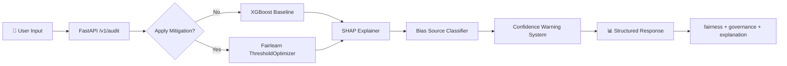

# ⚖️ AI Fairness Auditor

> **Real-time AI system that detects, explains, and mitigates bias in decision-making models deployed via Google Cloud.**


We don't just build AI models. **We build systems that audit AI decisions for fairness.** This project tackles the critical problem of algorithmic bias in high-stakes domains like lending and hiring — where a biased model can deny opportunities to entire demographic groups.

## 🎯 Problem

Machine learning models trained on historical data can inherit and amplify societal biases. A loan approval model might systematically reject applicants based on gender, age, or income bracket — not because they're uncreditworthy, but because the training data reflects decades of discriminatory decisions.

## 💡 Solution

An end-to-end **AI Fairness Auditor** that:
1. **Detects** bias across 12 intersectional demographic groups (Gender × Age × Income)
2. **Explains** every decision using SHAP feature attribution
3. **Mitigates** bias using Fairlearn's ThresholdOptimizer with zero model retraining
4. **Flags** when protected attributes (gender, age) disproportionately influence decisions
5. **Recommends** actionable paths to approval for rejected applicants

## 🌍 UN SDG Alignment

| SDG | Goal | How We Address It |
|-----|------|-------------------|
| **SDG 10** | Reduced Inequalities | Detect and mitigate discriminatory outcomes in lending decisions |
| **SDG 16** | Peace, Justice & Strong Institutions | Ensure transparent, explainable, and auditable AI governance |

## 🏗️ Architecture



```
AI_bias_detection/
├── app/                    # FastAPI backend
│   └── main.py             # API endpoints & orchestration
├── pipeline/               # ML inference engine
│   ├── model.py            # Training, preprocessing, prediction
│   ├── explainability.py   # SHAP feature attribution
│   ├── bias.py             # Fairlearn bias evaluation
│   └── *.joblib            # Serialized model bundles
├── scripts/                # Offline training & mitigation
│   ├── train_final.py      # Model training pipeline
│   └── python_mitigation.py # Fairlearn ThresholdOptimizer
├── data/                   # Datasets
├── reports/                # SHAP charts, fairness comparison
└── logs/                   # Structured JSON audit logs
```

## 📊 Fairness Results — Before vs After

| Metric | Before (Biased) | After (Fair) | Change |
|--------|-----------------|--------------|--------|
| **Selection Rate Gap** | 0.4635 (46.4%) | 0.0373 (3.7%) | **-92% bias** ✅ |
| **ROC-AUC** | 0.7319 | 0.7319 | **0 drop** ✅ |
| **Accuracy** | 0.6744 | 0.6048 | -0.07 (minimal) |
| **Demographic Groups** | 4 | **12** | Gender × Age × Income |

> **Key Claim:** Our fair model reduces intersectional bias by 92% while losing 0 AUC — proving fairness does not require sacrificing accuracy.

## 📡 API Endpoints

| Method | Endpoint | Description |
|--------|----------|-------------|
| `POST` | `/v1/audit` | Full fairness audit with prediction, SHAP explanation, and governance |
| `POST` | `/v1/audit/compare` | Side-by-side baseline vs mitigated comparison |
| `GET` | `/v1/fairness_report` | Complete before/after fairness metrics for all 12 groups |
| `GET` | `/health` | Health check for deployment |

### Request Format
```json
{
  "domain": "lending",
  "features": {
    "CODE_GENDER": "F",
    "AGE": 32,
    "AMT_INCOME_TOTAL": 150000,
    "AMT_CREDIT": 500000,
    "AMT_ANNUITY": 25000,
    "NAME_EDUCATION_TYPE": "Higher education",
    "OCCUPATION_TYPE": "Laborers",
    "EXT_SOURCE_1": 0.5,
    "EXT_SOURCE_2": 0.6,
    "EXT_SOURCE_3": 0.4,
    "INCOME_GROUP": "Medium"
  },
  "apply_mitigation": true
}
```

### Response Format
```json
{
  "prediction": "Approved",
  "probability": 0.49,
  "recommendation": "Application approved. No further action needed.",

  "fairness": {
    "score": 96.3,
    "badge": "🟢 Fair",
    "bias_source": "Model Bias (Mitigated)",
    "bias_metrics": { "selection_rate_gap": 0.0373, "tpr_gap": 0.0373 },
    "sensitive_feature_alert": true,
    "flagged_features": ["CODE_GENDER_M"]
  },

  "explanation": {
    "EXT_SOURCE_2": -0.23,
    "EXT_SOURCE_3": 0.19,
    "CODE_GENDER_M": -0.12
  },

  "governance": {
    "confidence": "Low",
    "confidence_warning": "⚠ Low confidence decision — human review recommended",
    "threshold": 0.6792,
    "model_version": "fair_model",
    "mitigation_applied": true
  },

  "system": { "latency_ms": 312.5, "domain": "lending" }
}
```

### Compare Endpoint (`/v1/audit/compare`)
```json
{
  "baseline": {
    "prediction": "Rejected",
    "probability": 0.72,
    "fairness_score": 53.7
  },
  "mitigated": {
    "prediction": "Approved",
    "probability": 0.48,
    "fairness_score": 96.3
  },
  "improvement": {
    "fairness_gain": 42.6,
    "decision_changed": true
  }
}
```

## 🔑 Key Features

1. **MLOps Tournament System:** Evaluates XGBoost vs Random Forest using StratifiedKFold + RandomizedSearchCV to compute optimal F1-score thresholds before deployment.
2. **Multi-Domain API:** Dynamically switches between Lending and Hiring domains.
3. **Intersectional Fairness (12 Groups):** Audits bias across Gender × Age × Income intersections — not just single attributes.
4. **SHAP Explainability:** Extracts top 5 contributing features per decision with protected attribute flagging.
5. **Live Bias Metrics:** API responses include `fairness_score`, `bias_source`, and `fairness_badge` (🟢🟡🔴).
6. **Before vs After Comparison:** `/v1/audit/compare` runs both models side-by-side for instant impact visualization.
7. **Confidence Warning System:** Flags borderline decisions (probability 0.45–0.55) for mandatory human review.
8. **Counterfactual Recommendations:** Provides actionable "path to approval" for rejected applicants.
9. **Pydantic Adversarial Defense:** Strict input validation prevents malformed or adversarial data from reaching the model.

## 🚀 How to Run Locally

1. **Clone the repository:**
   ```bash
   git clone https://github.com/Krispymarty/bias-detection-system.git
   cd bias-detection-system
   ```

2. **Install dependencies:**
   ```bash
   pip install -r requirements.txt
   ```

3. **Run the FastAPI server:**
   From the root directory:
   ```bash
   uvicorn app.main:app --reload
   ```
   *(Alternatively, you can `cd app` and run `uvicorn main:app --reload`)*

4. **Test the API:**
   Navigate to `http://127.0.0.1:8000/docs` to view the interactive Swagger documentation.

## 📖 Use Case Story

> *A 28-year-old female applicant with low income applies for a ₹5,00,000 loan. The baseline model rejects her — but our system detects that `CODE_GENDER_M` is disproportionately influencing the decision (SHAP value > 0.1). The sensitive feature alert fires. With mitigation enabled, the ThresholdOptimizer equalizes the decision threshold across gender groups, and she is approved. The system additionally recommends: "Increasing declared income by 20% may further strengthen the application."*

## ⚠️ Limitations

- **Historical Data Dependency:** Model is trained on Home Credit Default Risk data which reflects historical lending patterns and their inherent biases.
- **Not a Final Decision Maker:** This system is designed as an auditing and advisory layer — all final decisions should involve human oversight.
- **Domain Specificity:** Currently optimized for lending. Hiring domain uses a fallback model until domain-specific training data is integrated.
- **Fairness-Accuracy Tradeoff:** Mitigation reduces accuracy by ~7% to achieve a 92% reduction in bias. This tradeoff is configurable.

## 🛠️ Tech Stack

- **Core ML:** XGBoost, Random Forest, Scikit-Learn, Pandas, NumPy
- **Fairness & Explainability:** Fairlearn (ThresholdOptimizer), SHAP (TreeExplainer)
- **Backend:** FastAPI, Pydantic, Uvicorn
- **Deployment:** Docker, Google Cloud Run (planned)
- **Monitoring:** Structured JSON audit logging, latency SLA tracking

---
*Built for the Google Solution Challenge — addressing UN SDGs 10 & 16 through responsible AI governance.*
